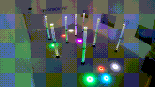
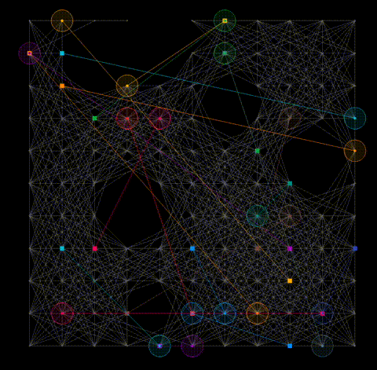

# LaCAM for MAPF-X

[](https://doi.org/10.1038/s44182-026-00083-2)
[](LICENSE)



LaCAM implementation for multi-agent path finding with execution constraints, used in ["Concrete Multi-Agent Path Planning Enabling Kinodynamically Aggressive Maneuvers (npj Robotics 2026)"](https://proroklab.github.io/agile-mapf).
The core solver is written in C++, and the repository also includes an optional
visualizer.

## Requirements

- CMake 3.16 or newer
- A C++17 compiler
- `yaml-cpp`
- `Eigen3`
- Git submodules enabled for vendored dependencies

Examples:

- macOS with Homebrew: `brew install yaml-cpp eigen`
- Ubuntu: `sudo apt-get install libyaml-cpp-dev libeigen3-dev`

## Quickstart

The commands below build only the core solver and tests.

```sh
git clone <this-repo>
cd <this-repo>
git submodule update --init --recursive third_party/argparse third_party/cnpy
cmake -B build
cmake --build build -j4
```

You do not need `third_party/openFrameworks` unless you plan to build the
visualizer.

## Usage

Basic run:

```sh
./build/main -v 3 -N 3 -O 1
```

The default output file is `build/result.txt`.

To run on a graph loaded from file, use `--graph_file`.
The repository includes an example at `assets/example-graph.txt`:

```sh
./build/main -v 3 -t 1 --graph_file assets/example-graph.txt -N 3 -O 1
```

To inspect all available options:

```sh
./build/main --help
```

## Demo



The underlying solver run used:

```sh
./build/main -v 3 \
    --num_random_obstacles 8 \
    --x_min -4 \
    --x_max 4 \
    --y_min -4 \
    --y_max 4 \
    --connection_rad 3.0 \
    --Hz 5 \
    --action_model assets/robomaster_example_model/best \
    -N 20 \
    --objective 1 \
    --num_planners 10 \
    -t 30
```

## Anytime Search Behavior

With `--objective 1`, `2`, or `3`, the solver keeps the best solution found so
far and continues searching until one of the following happens:

- the time limit from `--time_limit_sec` is reached
- the search space is exhausted, which proves optimality for the selected objective

With `--objective 0` (default), the solver does not operate as an anytime
optimizer. It returns immediately after finding the first feasible solution.

## Learned Action Model Requirements

The `--action_model` option is optional. If you do not pass it, the solver uses
the default hand-configured action model parameters from the other
`*_default` flags.

When `--action_model` is provided:

- You can pass either a model prefix such as
  `assets/robomaster_example_model/best`, or a matching `.jit.pt` / `.pt`
  path for backward compatibility.
- The matching `.pt_hypra.yaml` and `.npz` files must exist next to that model
  file, using the same filename prefix.
- The feature is available only when those model assets are present.
- This repository does not require a separate Python or libtorch runtime at
  inference time; the model parameters are loaded directly by the C++ solver.

With the bundled 2D learned uncertainty model:

```sh
./build/main -v 3 -N 3 --action_model=assets/robomaster_example_model/best
```

For example, selecting `assets/robomaster_example_model/best` also
requires:

- `assets/robomaster_example_model/best.pt_hypra.yaml`
- `assets/robomaster_example_model/best.npz`

When `--action_model` is set, `--length_past_locs` is inferred from the model
definition rather than from the CLI flag.

The bundled example model uses a standard MLP structure like this:

```text
==========================================================================================
MLP                                      [1, 2]                    --
├─Sequential: 1-1                        [1, 4]                    --
│    └─Linear: 2-1                       [1, 64]                   704
│    └─ReLU: 2-2                         [1, 64]                   --
│    └─Linear: 2-3                       [1, 64]                   4,160
│    └─ReLU: 2-4                         [1, 64]                   --
│    └─Linear: 2-5                       [1, 4]                    260
==========================================================================================
```

For details, see the implementation in `action_model_torch.cpp` and the
corresponding model hyperparameter file.

## Tests

Run the default self-contained test suite with:

```sh
ctest --test-dir build --output-on-failure
```

## Visualizer

The visualizer is optional and completely separate from the core solver build.

- Core solver users can ignore this section.
- The visualizer is currently documented only for macOS.
- The current visualizer is effectively 2D; it does not render full 3D scenes
  even though the solver core can represent `z` coordinates.
- The repository-root `./viz` helper is macOS-only because it launches the built `.app` bundle directly.
- Linux and other platforms are not documented or regularly validated in this repository.
- Visualizer setup requires the heavy `third_party/openFrameworks` submodule and platform-specific prerequisites.
- Detailed visualizer instructions live in [visualizer/README.md](visualizer/README.md).

If you want the visualizer, initialize the extra submodule:

```sh
git submodule update --init --recursive third_party/openFrameworks
```

On macOS, the minimal flow is:

```sh
bash third_party/openFrameworks/scripts/osx/download_libs.sh
cd visualizer
make -j4
cd ..
./viz build/result.txt
```

## Citation

```bibtex
@article{okumura2026concrete,
  title   = {Concrete Multi-Agent Path Planning Enabling Kinodynamically Aggressive Maneuvers},
  author  = {Okumura, Keisuke and Yang, Guang and Gao, Zhan and Woo, Heedo and Prorok, Amanda},
  journal = {npj Robotics},
  year    = {2026},
  doi     = {10.1038/s44182-026-00083-2}
}
```
